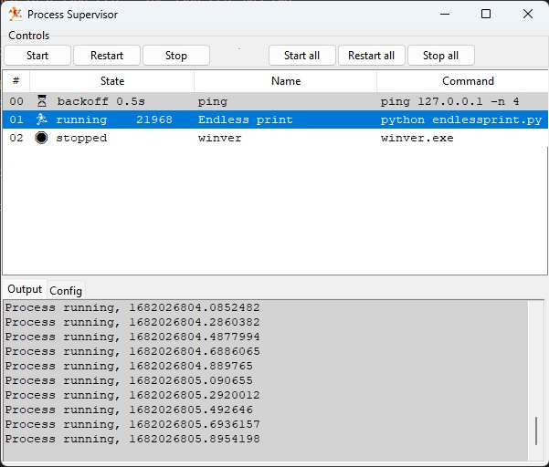

# Process supervisor 


This is a simple process supervisor that uses tkinter to display the status of
multiple processes.  

The processes are defined in a json file, by default named `proc_supervisor.json` in the working folder,
however the software will take the file name of the file as an argument.


The json file has two top level keys, "config" and "processes". 

The "config" key contains a dictionary of configuration items.  (TBD)

The "processes" key contains a list of dictionaries.  Each dictionary contains the
configuration for a single process.  The dictionary contains the following keys:

    "name" - the name of the task (used in the GUI)
    "command" - the command to run 
    "run" - True if the process should be started when the supervisor is started
    "rerun" - rerun process if it terminated unexpectedly (True by default)
    "initial_delay" - the number of seconds to wait before starting the process on first run
    "backoff_on_restart" - the number of seconds to wait before restarting the process after it terminated unexpectedly

## Example configuration used for testing    
```
{ "config" : {},
    "processes" : [{  
                "name": "ping",
             "command": "ping 127.0.0.1 -n 4",
                 "run": false,  
                "initial_delay": 0.5  
             },
                 {  
                "name": "Endless print",
             "command": "python endlessprint.py",
                 "run": true    },
                    {   
                "name": "winver",
                "command": "winver.exe",
                    "run": false ,
                    "rerun": false   }
                        
                
                ]
}
```

## Compilation

The program can be compiled to an exe using pyinstaller, with the provided `makeexe.bat` batch on Windows.

*  `processsupervisorw.exe` - a program without the console window
*  `processsupervisor.exe` - pops up console


## Example appearance




## Known bugs

* The last part of the output of a process, when it is terminated may not be reproduced.
* _On exit a few console windows may flash_

