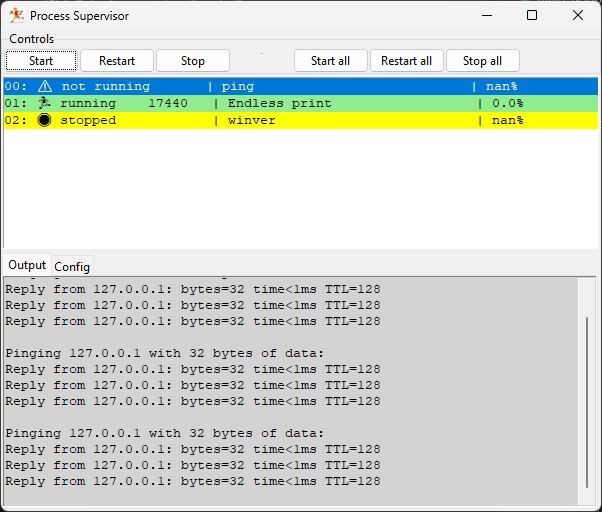

# Process supervisor 

This is a simple process supervisor that uses tkinter to display the status of
multiple processes.  

The processes are defined in a json file.  The json file has two
top level keys, "config" and "processes". 

The "config" key contains a dictionary of configuration items.  (TBD)

The "processes" key contains a list of dictionaries.  Each dictionary contains the
configuration for a single process.  The dictionary contains the following keys:

    "name" - the name of the process
    "command" - the command to run
    "run" - True if the process should be started when the supervisor is started
    "initial_delay" - the number of seconds to wait before starting the process
    "backoff_on_restart" - the number of seconds to wait before restarting the process

## Compilation

The program can be compiled to an exe using pyinstaller, with the provided 'makeexe.bat' batch on Windows.

 processsupervisorw.exe - a program without the console window
 processsupervisor.exe - pops up console

## Example appearance

## Known bugs

* The last part of the output of a process, when it is terminated may not be reproduced.

